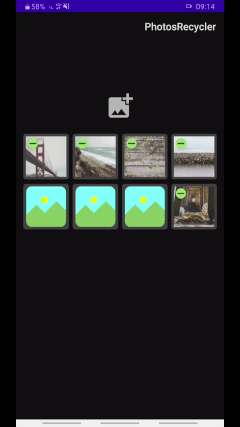
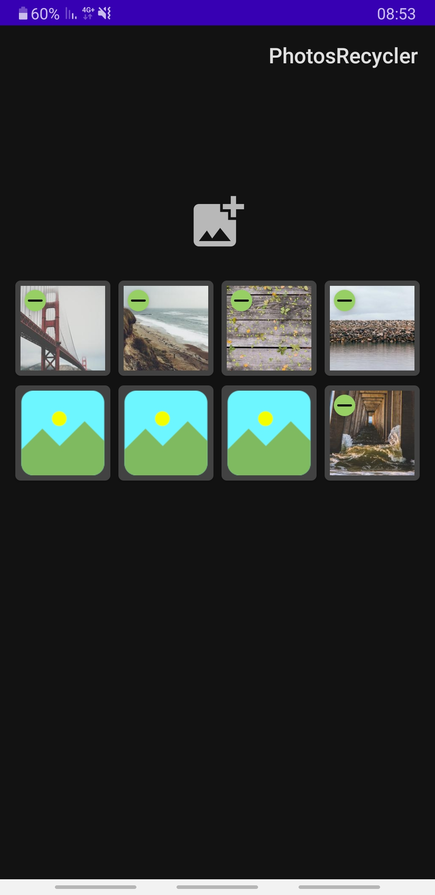
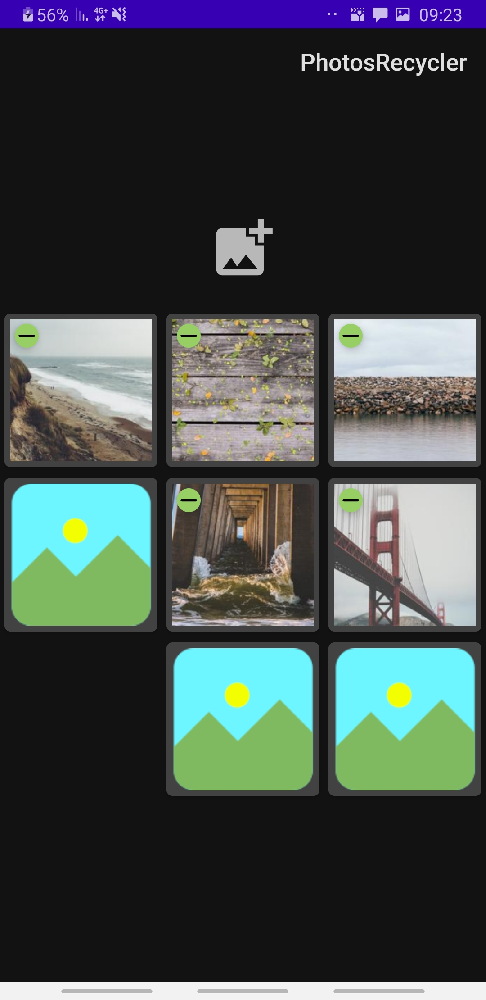
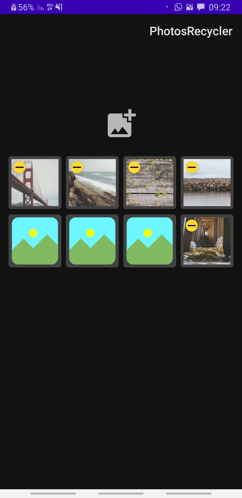
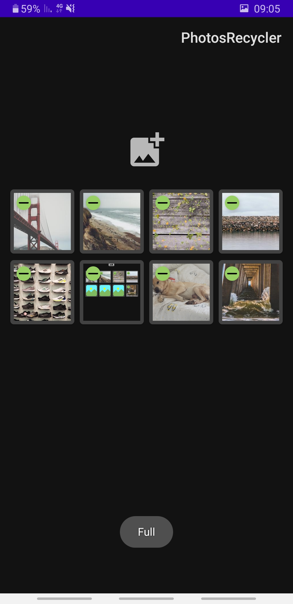

# PhotosRecyclerView - Android
A simple and customizable library for managing photos preview inside a recyclerview.
* Use it in activity or fragment.
* Use it in linear/horizontal view or grid.
* Customizable delete button color.
* Customizable photos size.
* Contain an ArrayList of strings which represent the urls of the images.



## Download
Add this to your build.gradle:

This library uses Gradle for loading the images into the ImageViews(no need to implement it for using this library).

## Pre-requisites
* 
## Usages
### Layout XML
Add ` PhotosPreviewRecyclerview ` in your layout.

``` <com.example.photosrecyclerview.PhotosPreviewRecyclerview
            android:id="@+id/recycler"
            android:layout_width="wrap_content"
            android:layout_height="wrap_content"/> 
```

You will see a fake preview in Android Studio of the recycleView.

## In your Activity / Fragment
Use ` findViewById ` to find your ` PhotosPreviewRecyclerview `:
`PhotosPreviewRecyclerview recycler = findViewById(R.id.recycler);`

First you **must** to initialize the recycler by calling the `init` function :
`recycler.init(YOUR_DESIRED_PHOTOS_NUMBER : int);`


<!--  -->

By default, this recyclerView uses `GridLayoutManager` with a span of 4.
To change the span just use `recycler.setSpanCount(YOUR_DESIRED_SPAN_COUNT : int);`
you can change the layout manager by simply setting another layout manager :
`recycler.setLayoutManager(new LinearLayoutManager(getContext(),HORIZONTAL/VERTICAL, false));`

You can change the photos size in the recycler by simply calling `setImagesSize` function:
`recycler.setImagesSize(WIDTH,HEIGHT : int);`
**The width and height in dp!**



You can change the color of the delete button by calling `setDeleteButtonColor` :
`recycler.setDeleteButtonColor(R.color.ANY_COLOR : int);`



You can change the place holder image with `recycler.setPlaceholder(RESOURCE_ID : int);` .

In order to add photos to the recycler just call `recycler.addPhoto(STRING_URL : string)`
The url can be from the internet or from the external storage.

Also there's an option to load the recyclerView with predefined urls :
First create an `ArrayList<String>` :
```
ArrayList<String> urls = new ArrayList<>();
        urls.add("https://picsum.photos/200/300");
        urls.add("https://picsum.photos/200/301");
        urls.add("https://picsum.photos/200/302");
        urls.add("https://picsum.photos/200/303");
        urls.add("https://picsum.photos/200/304");
```
Then `recycler.setImagesUris(urls : ArrayList<String>);`

If the recycler reaches his limit of capacity a Toast will appear with the message 'Full',
you can change it by calling `recycler.setMessageWhenFull(YOUR_DESIRED_MESSAGE_IN_STRING : string);`



There is a listener for touch/click event on each of the photos, you can do whatever you want there : 
```
recycler.setOnTouchPreviewImageListener(new PreviewImagesAdapter.OnTouchPreviewInterface() {
            @Override
            public void onTouch(int position, View view) {
                // do whatever you want
            }
        });
```


